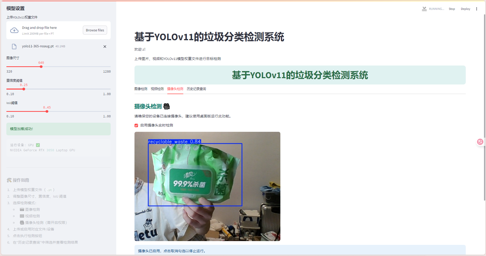

# ♻️ YOLOv11 垃圾分类检测系统

基于 Streamlit + YOLOv11 + OpenCV + MySQL 构建的智能垃圾检测平台，支持图像、视频、摄像头实时检测，并提供历史结果查询与模型管理功能。

<div align="center">
    
    
    
    
</div>

---

## 🖼️ 系统界面预览



---

## 🚀 功能亮点

- ✅ 用户登录 / 注册系统（账户隔离，私有记录）
- 🧠 加载自定义 YOLOv11 模型权重 `.pt`
- 🖼️ 图像检测（实时展示目标框与类别）
- 🎞️ 视频检测（自动转码，支持播放与下载）
- 🎥 摄像头检测（本地实时推理）
- 📦 检测结果写入数据库，支持：
  - 日期筛选
  - 类别筛选
  - 图像名搜索
- ⬇️ 一键导出检测历史为 `.csv`
- 💻 GPU / CPU 运行环境自动识别
- 🎨 视觉界面优化（按钮、标题、动画、主题色）

---

## 📦 安装与运行

### 1️⃣ 安装依赖环境

```bash
git clone https://github.com/yourname/yolov11-trash-detect.git
cd yolov11-trash-detect

# 建议使用虚拟环境
python -m venv venv
source venv/bin/activate  # or venv\\Scripts\\activate on Windows

pip install -r requirements.txt
````

<details>
<summary>📄 requirements.txt 示例</summary>

```txt
streamlit
ultralytics
opencv-python
numpy
Pillow
mysql-connector-python
```

</details>

---

### 2️⃣ 配置数据库（MySQL）

> 请确保你已安装 MySQL 并启动服务。

#### 修改数据库连接信息：

在 `UI_user_result_history.py` 中配置：

```python
DB_CONFIG = {
    "host": "localhost",
    "user": "root",
    "password": "你的密码",
    "database": "dbwaste"
}
```

#### 创建数据库（一次性操作）：

```sql
CREATE DATABASE dbwaste;
```

系统将自动创建 `users` 表和用户专属的 `results_用户名` 检测结果表。

---

### 3️⃣ 启动应用

```bash
streamlit run UI_user_result_history.py
```

---

## 🧭 使用指南

### 左侧控制栏设置参数：

* 上传模型权重 `.pt`
* 选择图像尺寸（默认 640）
* 设置置信度和 IoU 阈值

### 主界面操作：

| 模块        | 功能说明                      |
| --------- | ------------------------- |
| 📷 图像检测   | 上传单张图片并实时显示检测结果           |
| 🎞️ 视频检测  | 上传 `.mp4`/`.avi` 视频并处理后播放 |
| 🎥 摄像头检测  | 打开设备摄像头进行实时目标检测           |
| 📊 历史记录查询 | 根据用户名记录并支持筛选导出 `.csv`     |

---

## 🔐 用户系统说明

* 用户注册时系统自动为每个用户创建私有检测结果表；
* 检测记录永久保存，可随时按日期/类别查询；
* 数据库隔离，避免用户间干扰。

---

## 📂 项目结构说明

```
yolov11-trash-detect/
├── UI_user_result_history.py      # 主应用脚本
├── requirements.txt               # 所需依赖
├── README.md                      # 使用文档
├── screenshots/                   # 截图资源
└── weights/                       # 示例模型权重（可选）
```

---

## 💡 常见问题 FAQ

### Q1: 启动时为什么看到“启动动画”反复出现？

A: 系统使用 `st.session_state` 控制动画仅首次显示，请确保你没有人为清空 session。

### Q2: 视频播放太大，页面撑爆？

A: 系统自动将处理后视频大小限定为 `640px` 并居中展示。

### Q3: 摄像头打不开？

A: 请确认是否允许浏览器/系统访问摄像头，建议使用桌面版运行 (`streamlit run`)。

---

## 📜 致谢

本系统基于以下开源工具开发：

* [Streamlit](https://streamlit.io/)
* [Ultralytics YOLO](https://github.com/ultralytics/ultralytics)
* [OpenCV](https://opencv.org/)
* [MySQL](https://www.mysql.com/)

---

## 📬 联系方式

如果你喜欢本项目或有改进建议，欢迎联系我：

* 📧 Email: [dinosaurerer@love.com](konglongxiao723@gmail.com)
* 💻 GitHub: [@dinosaurerer](https://github.com/dinosaurerer/YOLO-IWCA)

---

<div align="center">
    <b>🌿 让 AI 帮助城市更清洁 🌿</b>
</div>
```

---
